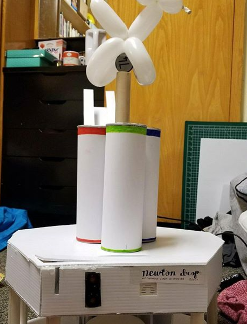
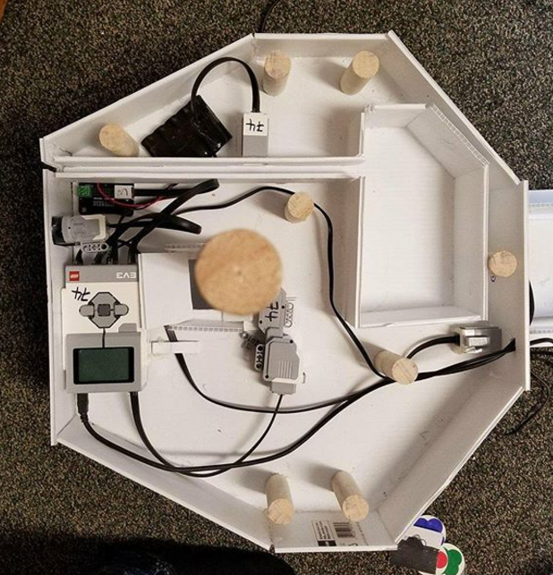
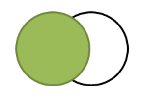

# Newton Drop - The Autonomous Candy Dispenser
The *Newton Drop* is an Autonomous Candy Dispensing Robot. The robot was controlled by a single program that controls the sensors &amp; movements of the robot. The Newton Drop uses two main motors (Rotator motor and the Tetrix Gripper motor) and three sensors (Ultrasonic, Touch & Color Sensor). The code also uses Sound Files, Sound Tones, and File I/O System. 

 
  
   <i>Front View</i>

  
   <i>Top View</i>

## Code Implementation

### Robot Tasks

  - Rotating the Cylinders
  - Releasing the Candy
  - Initial Calibration Setup
  - Consumer Recognition
  - Coin Recognition
  - Reading the Input File Data
  - Transferring the sales data into the output file
  - Playing a sound file 

## Special Features of the Code: 

1)	***The Golden Wait Time:*** 
  The EV3 Color Sensor given to us couldn’t detect a Green Colored Coin that well. This was presumed to be because it was perceiving a color of Half Green and Half White (Back Ground), as the color Blue. 

 
  
   <i>Golden Wait Time Demonstration</i>

  Hence, we added a wait time of 60 milliseconds, which is basically the time interval between the detection of a green coin, and the time it takes the green coin to reach the center of the *Color Sensor Recognition Frame*. This “Golden Wait Time” was experimentally determined after several tests. These experimental tests included averaging several time intervals and selecting the most consistent one. The experiments also account for the speed at which the coin is inserted, and this wait time works for most of the speeds. 

2)	***Smart Consumer Recognition:***

  This feature automatically recognizes a consumer and prompts a command upon recognition. The code ensures that a consumer is detected if and only if it stands in front of the sensor (at an appropriate distance), for a minimum time interval. Hence, it does not recognize a random person walking past the robot.

3)	***Text-To-Speech Instructions:***

  Another special feature of the Newton Drop is that it provides instructions (in words!) to the consumer. This was done using the Sound Files System on the EV3. The sound files were downloaded from online text-to-speech converters and then were downloaded onto the EV3.

4)	***Showboat:***
  The robot ends by spinning the cylinders, and playing the Mission Impossible Tune. It also displays the total sales for the day on the EV3 Screen.

5)	***Emergency-Exit:***
  The code ensures that the Robot can be stopped immediately in case of emergencies by holding the touch sensor.
